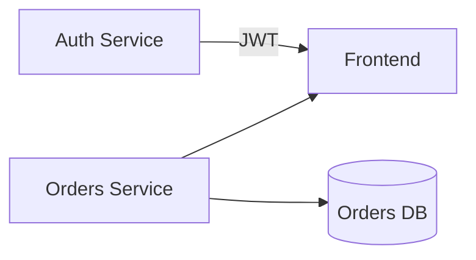

# Service / Microservice

A *service* is an independently deployable unit owning a specific capability.

```mermaid
flowchart LR
  A[Auth Service] -->|JWT| UI[Frontend]
  B[Orders Service] --> UI
  B --> DB1[(Orders DB)]
```

Related: [[Docker]] • [[Backend]] • [[Traefik]]
